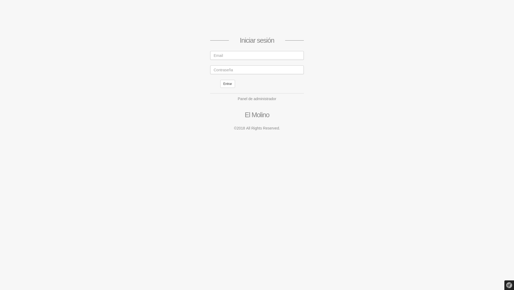
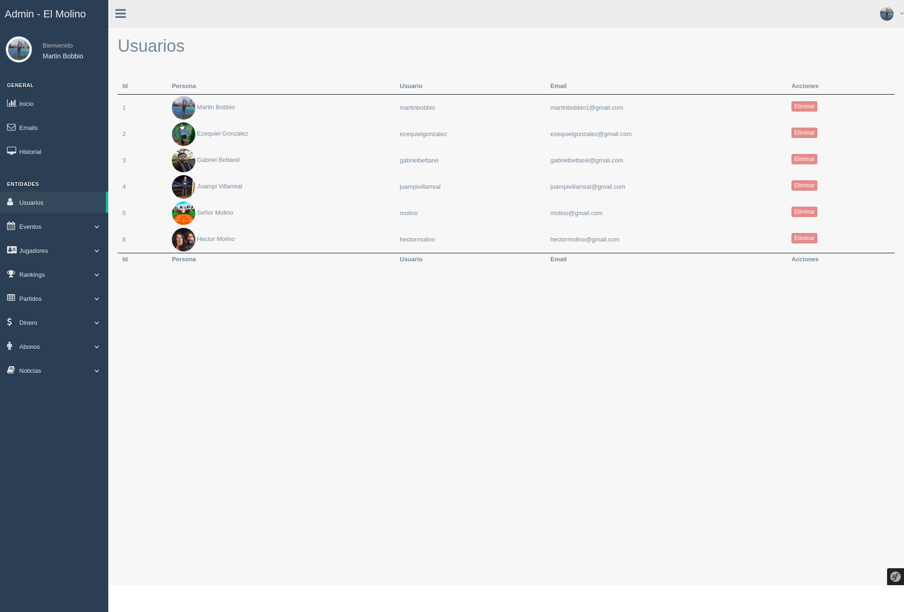
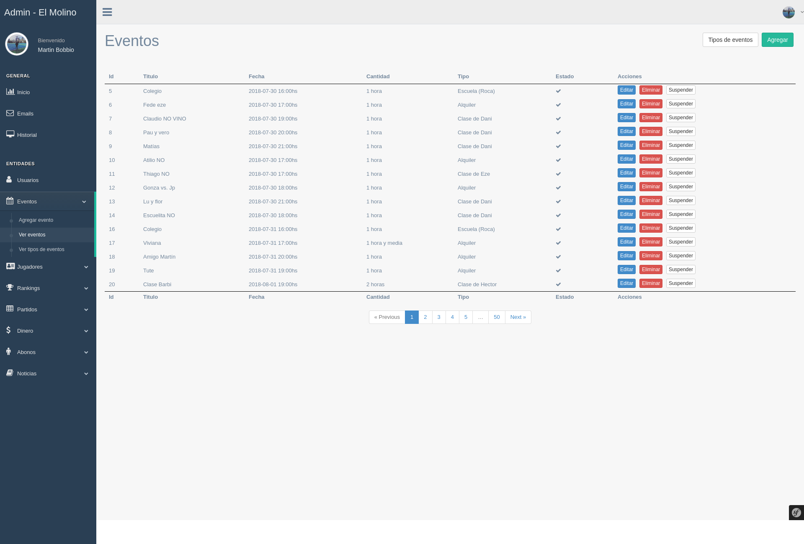
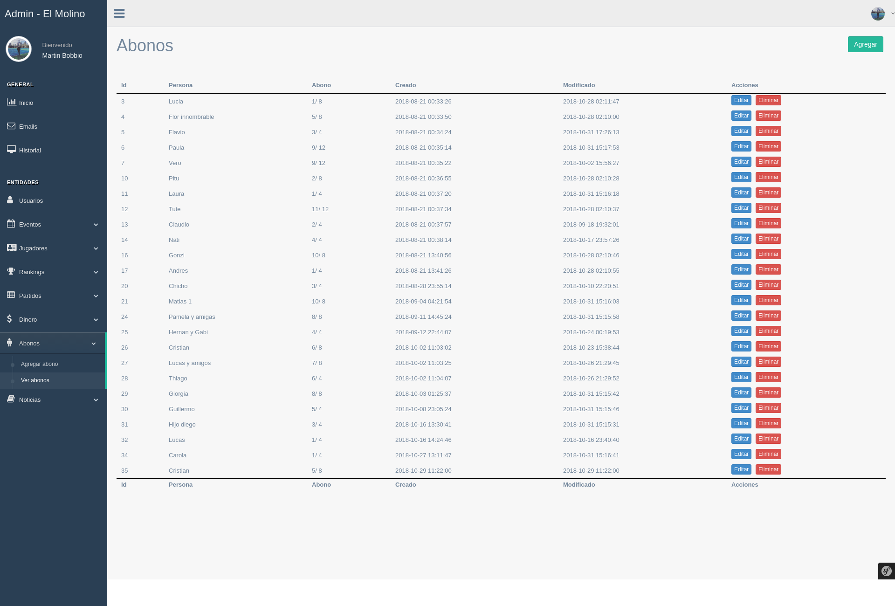

<h1 align="center">
   
  
   
  El Molino - Backend
   
</h1>
<h4 align="center">
  <a href="https://github.com/martinbobbio/frontend-molino-tenis">El Molino - Frontend</a>
   -  
  <a href="https://github.com/martinbobbio/app-molino-tenis">El Molino - APP</a>
</h4>

# Descripción

Sistema para el Molino tenis de Hurlingham.
Conecta la pagina web y la app con ApiRest hecho en symfony

# Capturas

### Login

### Usuarios

### Eventos

### Abonos

